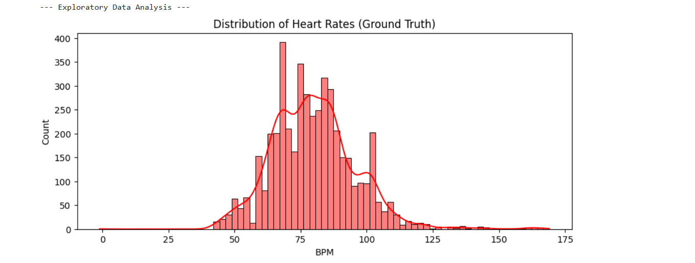
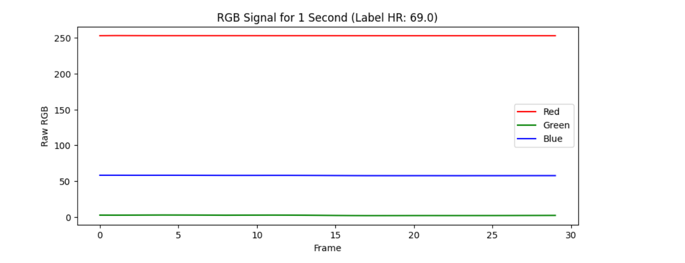
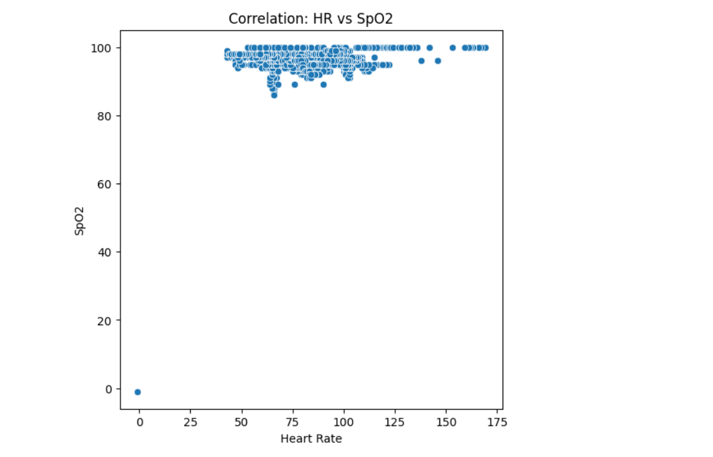
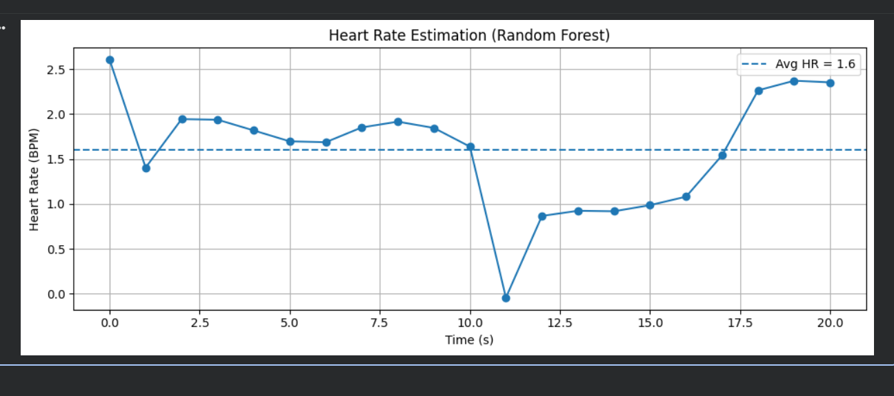

# Heart Rate Prediction from Video Input/Camera

This project predicts heart rate and SpO2 from fingertip video data using deep learning and machine learning models.
Download this [notebook](https://github.com/AndrewBlur/HeartRatePrediction/blob/main/notebooks/starter_kit.ipynb) and try it in your colab 
## Project Structure

- `dataset/`:  he data is from [MEDVSE repository](https://github.com/MahdiFarvardin/MEDVSE).
- `model/`: Contains the Python source code for data loading, preprocessing, modeling, training, evaluation, and prediction.
- `notebooks/`: Can be used for experimental notebooks.

## Usage

1. **Install dependencies:**
   ```bash
   pip install -r requirements.txt
   ```

2. **Download data:**
   - The data is from [MEDVSE repository](https://github.com/MahdiFarvardin/MEDVSE).

3. **Run the pipeline:**
   ```bash
   python main.py
   ```

## Models

This project implements and compares the following models:

- Random Forest
- Extra Trees
- Temporal Convolutional Network (TCN)

## Test Metrics 

| Model               |   R^2   |     MAE    |    RMSE    |   MSE   |
|---------------------|---------|------------|------------|---------|
| Random Forest       |  0.943  |  2.82 BPM  |  3.94 BPM  |  15.53  |
| Extra Trees         |  0.947  |  2.72 BPM  |  3.80 BPM  |  14.47  |
| TCN                 |  0.946  |  2.71 BPM  |  3.83 BPM  |  14.67  |

## Project Demo

Below is a demonstration of the heart rate detection system in action.


## Results

Below are some screenshots of the heart rate detection system.








